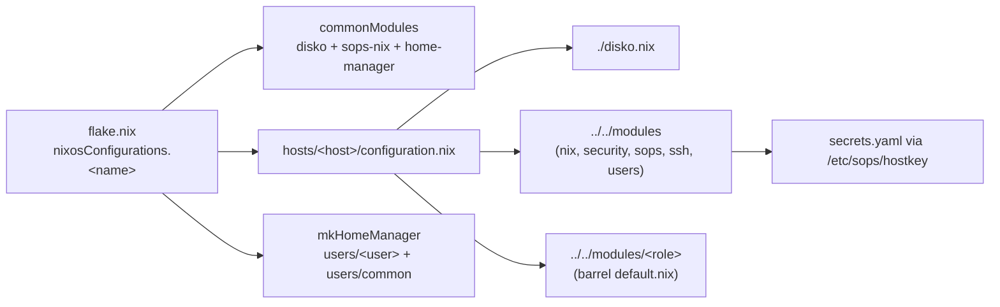

# Repository Guidelines

## Project Overview

`genix` is the NixOS flake that declaratively manages every machine used at GEHACK competitive-programming contests (FPC, EAPC, EUC26): contest workstations, the network gateway, the scoreboard kiosk, and a live ISO. There is no imperative provisioning — a machine's entire state is one `nixosConfigurations` attribute.

Upstream: `git@github.com:GEHACK/genix.git`. Contestant-facing docs are published from `docs/` to `os.gehack.nl`.

## Architecture & Data Flow

Single composition point (`flake.nix`) → thin host file → module barrel → per-concern module.



Four layers, in evaluation order:

1. **`flake.nix`** — declares contest-wide facts as `specialArgs`: `dj_url`, `loom_url`, `judge_ip = "10.0.0.1"`, `contest_subnet = "10.0.0.0/24"`. Builds each system as `commonModules ++ <role-specific flake-input modules> ++ mkHomeManager {...} ++ ./hosts/<host>/configuration.nix`.
2. **`hosts/<host>/configuration.nix`** — the *only* thing that imports `modules/`. Contains just `imports = [ ./disko.nix ../../modules ../../modules/<role> ];`, hardware facts, and a declarative toggle block. No logic.
3. **`modules/`** — `modules/default.nix` is a barrel imported by every host; `modules/<role>/default.nix` is a barrel of single-concern files.
4. **`users/`** — **home-manager modules only**, wired in `flake.nix` via `mkHomeManager`. They never contain `users.users.*`.

**The option router** (`modules/teammachine/user-tools.nix`) is the key non-obvious mechanism:

```nix
config.home-manager.users = lib.mapAttrs (_name: userCfg: { teammachine = userCfg; }) config.teammachine.users;
```

So `teammachine.users.team.languages.cpp.enable = true` in the host file becomes `home-manager.users.team.teammachine.languages.cpp.enable`. An entire workstation is configured from one block in `hosts/teammachine/configuration.nix`.

**Secrets flow one way**: `modules/sops.nix` binds every host to `secrets.yaml`, decrypted with the age key at `/etc/sops/hostkey`. Modules declare `sops.secrets.<name> = { owner; group; mode; }` and consume `config.sops.secrets.<name>.path` — never the value.

**Deployment** is either direct (`nixos-anywhere` → disko → toplevel) or relayed through geproxy's custom `services.buildFanout` (`modules/geproxy/fanout.nix`), an SSH forced-command dispatcher that intercepts nixos-rebuild's own SSH protocol and re-fans the closure to every laptop in loom's inventory.

## Key Directories

| Path | Purpose |
|---|---|
| `flake.nix` | Sole composition point: inputs, `specialArgs`, module lists, all outputs |
| `hosts/<host>/` | `configuration.nix` + `disko.nix`. Thin — hardware + toggles only |
| `modules/` | Base modules applied to every host (`nix`, `security`, `sops`, `ssh`, `users`) |
| `modules/teammachine/` | Contest laptop: greetd/loom-greeter, GNOME, nftables, printer, PXE, usbguard |
| `modules/geproxy/` | Gateway: bridges, dnsmasq/PXE, traefik, cuproxy, imaged, balloons, fanout |
| `modules/scoreboard-laptop/` | `cage` Wayland kiosk running the ICPC presentation client |
| `users/common/` | HM `sharedModules`: declares `teammachine.languages.*`, firefox policy, nixvim |
| `users/team/`, `users/gehack/` | Per-user HM profiles |
| `scripts/` | Deploy wrappers (see the `format.sh` warning below) |
| `assets/` | Media consumed **by Nix** (wallpaper, Plymouth logo) — unrelated to `docs/assets/` |
| `docs/` | Jekyll site (github-pages gem, cayman theme) for contestants |

## Development Commands

```bash
# Build-check a host — the closest thing to CI this repo has
nix build .#nixosConfigurations.teammachine.config.system.build.toplevel
nix build .#nixosConfigurations.geproxy.config.system.build.toplevel
nix build .#nixosConfigurations.scoreboard-laptop.config.system.build.toplevel

# VM smoke test (teammachine → host port 2222, geproxy → 2223)
nix build .#packages.x86_64-linux.teammachine-vm
./result/bin/run-*-vm
ssh -p 2222 root@localhost

# Build the live ISO
nix build .#packages.x86_64-linux.teammachine-iso

# Provision bare metal (prefer the wrapper over the raw nixos-anywhere call)
./scripts/nixos-anywhere.sh <FLAKE_TARGET> root@<IP>
./scripts/nixos-anywhere.sh -J <jump> -i <key> --extra-files ./tmp \
  --chown /etc/sops/hostkey root:root <FLAKE_TARGET> root@<IP>

# Deploy an update
./scripts/install.sh <FLAKE_TARGET> root@<IP>   # remote — NO confirmation prompt
./scripts/install.sh <FLAKE_TARGET>             # local, sudo, prompts

# ARM cross-deploy (the wrappers do not support this — no --build-host)
nixos-rebuild switch --flake .#teammachine_arm \
  --target-host root@<IP> --build-host root@<IP> \
  --option builders "ssh://root@<IP>"

# Secrets
sops secrets.yaml                 # only legal way to edit
sops updatekeys secrets.yaml      # after adding a recipient to .sops.yaml

# SSH keys / inputs
./scripts/update_keys.sh
nix flake update
```

**There is no lint or format command.** `flake.nix` exposes no `formatter`, `devShells`, or `checks` output, and no nixfmt/treefmt/alejandra/statix config exists anywhere (grep-verified). `nix fmt`, `nix develop` and `nix flake check`-as-lint all do nothing useful. Match surrounding style by hand and verify with `nix build`.

> **`scripts/format.sh` is a disk formatter, not a code formatter.** It runs `disko --mode destroy,format,mount` against the *current* host. Never run it to tidy Nix files. Its `--flake ".#…"` ref is CWD-relative, so it must run from the repo root — README's `cd scripts` instruction is wrong.

### Flake targets

`nixosConfigurations`: `teammachine`, `teammachine_arm`, `geproxy`, `scoreboard-laptop`, `scoreboard-laptop_arm`, `teammachine-iso`.

`packages.x86_64-linux`: `teammachine`, `geproxy`, `scoreboard-laptop`, `teammachine-vm`, `geproxy-vm`, `teammachine-iso`.
`packages.aarch64-linux`: `teammachine-arm`, `scoreboard-laptop-arm`.

Note the naming split: **underscore** in `nixosConfigurations` (`teammachine_arm`), **hyphen** in `packages` (`teammachine-arm`). The `*-vm` targets exist only as packages — `nixos-rebuild --flake .#teammachine-vm` fails.

## Code Conventions & Common Patterns

**Barrel imports.** Every module directory has a `default.nix` that is *only* an `imports` list. A new file is dead code until it is added there.

```nix
# modules/<role>/default.nix
_: {
  imports = [ ./boot.nix ./desktop.nix ./networking.nix ];
}
```

**Argument heads.** `_:` when no arguments are used; otherwise destructure exactly what is needed and always end with `, ... }:`. `specialArgs` are destructured directly:

```nix
{ pkgs, lib, config, judge_ip, contest_subnet, ... }:
```

**Opt-in feature modules** — the dominant shape, used across `modules/teammachine/*` and `modules/geproxy/fanout.nix`:

```nix
let cfg = config.teammachine.webcamstream;
in {
  options.teammachine.webcamstream.enable = lib.mkEnableOption "webcam stream";
  config = lib.mkIf cfg.enable { /* … */ };
}
```

**Option namespaces**: system toggles under `teammachine.*` / `scoreboard.*`; the fanout mimics upstream naming as `services.buildFanout.*`. Home-manager options *also* live under `teammachine.*` — same prefix, different module system.

**Naming is layered and deliberately inconsistent**: kebab-case files and dirs (`user-tools.nix`, `pxe-boot.nix`), camelCase `let` bindings (`operatorKeys`), snake_case `specialArgs` (`dj_url`, `judge_ip`). Secrets are kebab-case (`loom-auth`) or dotted namespaces (`balloons.domjudge.user`, quoted in Nix).

**Contest facts flow via `specialArgs`, not options.** Changing `judge_ip` in `flake.nix` rewrites every laptop's firewall.

**Secrets by path, never by value.** Multi-value secrets use `sops.templates` with `config.sops.placeholder.*` (see `modules/geproxy/balloons.nix`) rather than shell-time concatenation.

**Firewall: nftables only — never introduce iptables rules.** Both roles set `networking.firewall.enable = false` plus `networking.nftables` with `checkRuleset = true`; geproxy uses `rulesetFile = ./assets/firewall.nft`, teammachine an inline ruleset built from `judge_ip`/`contest_subnet`.

**Inline derivations, zero overlays.** External packages come from flake-input `nixosModules` or `_module.args`. Local packages are `pkgs.writeShellApplication` / `writeShellScriptBin` / `stdenv.mkDerivation` inline in the consuming module. `grep nixpkgs.overlays` returns nothing.

**`mkForce` appears only in the ISO**; `mkIf` is the standard conditional; `mkDefault` is unused.

**Commits**: recent history uses Conventional Commits (`feat:`, `chore:`) without scopes; older history is free-form. Follow `feat:`/`fix:`/`chore:`. Branches are `<type>/<kebab-slug>`.

## Important Files

| File | Why it matters |
|---|---|
| `flake.nix` | Inputs, `specialArgs`, `commonModules`, `mkHomeManager`, `mkVmModule`, all outputs |
| `modules/default.nix` | Base barrel every host gets |
| `modules/sops.nix` | The entire secrets wiring: `keyFile = "/etc/sops/hostkey"`, `defaultSopsFile = ../secrets.yaml` |
| `modules/users.nix` | `mutableUsers = false`, the `gehack` admin, root keys from `../authorized_keys` |
| `modules/teammachine/user-tools.nix` | `teammachine.users` → home-manager router |
| `modules/geproxy/fanout.nix` | 250-line SSH forced-command deploy relay |
| `modules/geproxy/assets/firewall.nft` | Raw nftables ruleset; `chain contest_inet` is mutated at runtime |
| `users/team/languages.nix` | The real home of `mygcc`/`mygpp`/`mypython`/`myjavac`/`mykotlinc` |
| `authorized_keys` | **Generated.** Edit `USERS` in `scripts/update_keys.sh` instead |
| `fanout_pubkey` | Hand-maintained; grants geproxy root access to laptops |
| `.sops.yaml` | 4 recipients, one `creation_rules` entry for `secrets.yaml` |
| `README.md` | Operator manual — accurate on intent, stale in several specifics (below) |
| `bartjan.md` | Personal scratch notes with a hardcoded LAN IP. Not authoritative |

## Runtime/Tooling Preferences

- **Nix with flakes**, `nixpkgs` pinned to `nixos-26.05`. Only 3 of 9 inputs `follow` nixpkgs — `disko`, `loom`, `cuproxy`, `balloons`, `imaged` carry their own. Adding `inputs.nixpkgs.follows` is a behaviour change, not a cleanup.
- `nixConfig` declares two substituters: `luukblankenstijn.cachix.org` and `gehack.cachix.org`. Only honoured for trusted Nix users; otherwise every Rust/Go input builds from source.
- `sops` + an age key listed in `.sops.yaml` is required to touch secrets.
- External tools (`disko`, `nixos-anywhere`) are invoked ad-hoc via `nix run github:nix-community/<tool>` — there is no devShell.
- `system.stateVersion = "25.11"` on every host while nixpkgs is `26.05`. **Intentional — never "fix" it.**
- `home-manager.useGlobalPkgs = true`, so `nixpkgs.config` inside HM modules is ignored; `allowUnfree` must be set at the host level.

## Testing & QA

There is **no test framework and no CI** — no `.github/` directory exists, no `checks` output, nothing validates a push. Verification is manual and mandatory:

1. `nix build .#nixosConfigurations.<host>.config.system.build.toplevel` — catches evaluation and build errors.
2. `nix build .#packages.x86_64-linux.teammachine-vm && ./result/bin/run-*-vm` — boot and `ssh -p 2222 root@localhost` for behavioural changes.
3. Build every host you may have touched. Base modules under `modules/` affect all six configurations, and `teammachine-iso` must be built separately (see below).

## Footguns

Non-obvious traps, all verified against source:

- **`scripts/format.sh` destroys disks.** See the warning above. This is the single most dangerous name collision in the repo.
- **`install.sh` remote mode has no confirmation prompt** and immediately `switch`es a live host.
- **Both deploy scripts run `update_keys.sh` first**, which requires network access to github.com, hard-fails offline, and silently `git add`s `authorized_keys` into your index.
- **`authorized_keys` is generated and parsed by Nix.** `modules/geproxy/default.nix` reads it at eval time and filters `#`-prefixed lines into `services.buildFanout.authorizedKeys`, so the `# <username>` comment format is load-bearing. Hand edits are clobbered on the next deploy.
- **The ISO is a fork, not a variant.** `hosts/teammachine-iso/configuration.nix` uses `disabledModules = [ ../../modules/users.nix ]`, re-declares users inline with a literal `hashedPassword`, and imports **8 specific `modules/teammachine/*` files by path** rather than the barrel. Adding a file to `modules/teammachine/default.nix` does not reach the ISO; renaming one of those 8 breaks it. Never copy the literal-password pattern into a real host.
- **`teammachine.users` is `types.attrsOf types.attrs`** — typos are silently accepted at the NixOS layer and only explode inside home-manager, or not at all. `scoreboard-laptop` loads HM with *no* users, so `teammachine.users.*` there does nothing.
- **`modules/scoreboard-laptop/scoreboard.nix` is a package, not a module.** It is deliberately absent from the barrel and `callPackage`d from `desktop.nix`. Adding it to `default.nix` breaks evaluation.
- **`.#contestlaptop` does not exist** despite the comment at the top of `modules/geproxy/fanout.nix`. Use `.#teammachine`.
- **`enable-internet`/`disable-internet` are not declarative.** They mutate the live `chain contest_inet`; any `nixos-rebuild switch` reloads the ruleset and resets contest internet to disabled.
- **dnsmasq's uid/gid are pinned to 995** because `firewall.nft` matches `meta skuid 995`. Removing the pin silently breaks DNS egress filtering.
- **`admin-net-secure` listens on port `433`, not `443`** (`modules/geproxy/traefik.nix`). Looks like a typo; confirm with a human before changing.
- **All hosts share one age identity at `/etc/sops/hostkey`, and nothing in the repo provisions it.** Stage it locally and pass `--extra-files` + `--chown`; `.gitignore` carries `tmp/` for exactly this. A host without it fails activation, because `hashed-password` is `neededForUsers = true`.
- **`secrets.yaml` may only be edited with `sops secrets.yaml`.** It has a MAC; any other write corrupts it. `&kevin` is an `ssh-ed25519` key inside the `age:` group — intentional, do not normalise it to `age1…`.
- **`users.mutableUsers = false`** everywhere: `passwd` on a host is a no-op.
- **No `hardware-configuration.nix` exists anywhere.** Hardware facts (PCI bus IDs, NIC names, disk paths) are hand-written into `hosts/<host>/configuration.nix` and `disko.nix`. Never "regenerate" one.
- **Hostname ≠ flake attribute**: `teammachine` produces `networking.hostName = "team"`; `scoreboard-laptop` sets none.
- **Two contest IDs live in two layers**: `contestId = "fpcs2026"` in `modules/geproxy/balloons.nix` and `scoreboard.contestId = "ipc2026"` in `hosts/scoreboard-laptop/configuration.nix`. A new contest touches both.
- **`README.md` is stale in specifics**: its `authorized_keys` member list omits `mexdeloo`/`kevinjil` and lists a non-existent `zeo`; it cites `modules/teammachine/languages.nix` which does not exist (real path: `users/team/languages.nix`); it places DevDocs on the teammachine when it is a container on geproxy; it lists one cachix substituter when there are two; and it never mentions `scripts/nixos-anywhere.sh`. Trust the source.
- **`.gitignore` covers `CLAUDE.md` and `.claude` but not `AGENTS.md`** — this file is tracked.
